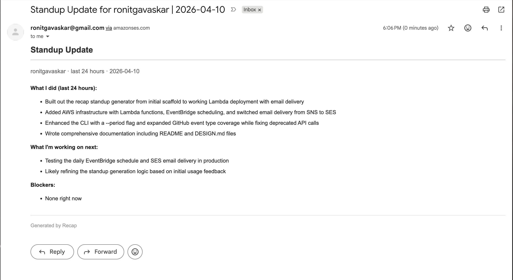
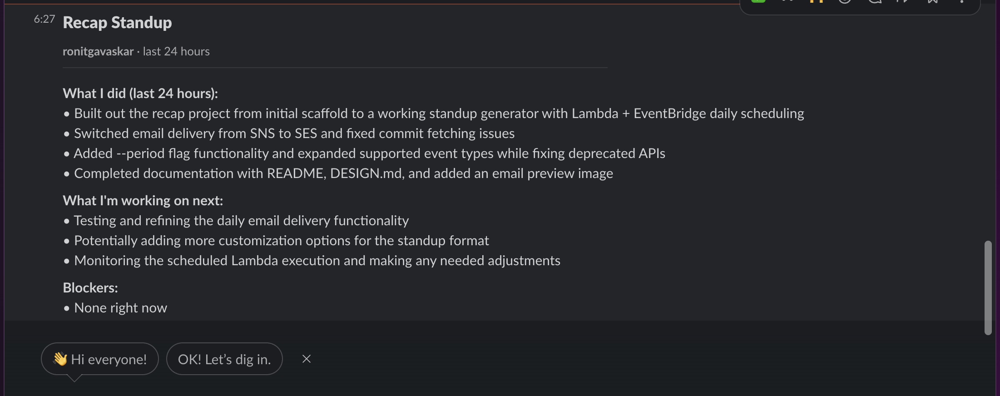

# Recap

Autonomous standup generator. Recap pulls your GitHub activity, feeds it to Claude, and delivers a formatted standup update -- zero input required.

Run it locally from the terminal or deploy it to AWS Lambda on a schedule to get standup emails every morning.

<table>
  <tr>
    <td></td>
    <td></td>
  </tr>
  <tr>
    <td align="center"><em>SES email delivery</em></td>
    <td align="center"><em>Slack webhook delivery</em></td>
  </tr>
</table>

## Architecture

```
Local CLI:    npm run dev --> GitHub API --> Claude API --> terminal

                                                     +--> SES --> email
Lambda:       EventBridge (cron) --> Lambda --> GitHub + Claude API --+
                                                     +--> Slack webhook
```

### Modules

| File | Responsibility |
|------|---------------|
| `src/github.ts` | Fetches commits, PRs opened/merged, reviews, repo events from GitHub |
| `src/claude.ts` | Sends activity to Claude and returns a formatted standup |
| `src/slack.ts` | Slack Block Kit message posting via incoming webhook |
| `src/index.ts` | CLI entry point -- parses flags, orchestrates the pipeline |
| `src/lambda.ts` | AWS Lambda handler -- same pipeline, plus SES and Slack delivery |
| `scripts/deploy.sh` | Builds, packages, and deploys the Lambda function |

## Prerequisites

- Node.js 20+
- A [GitHub personal access token](https://github.com/settings/tokens) with `repo` and `read:user` scopes
- An [Anthropic API key](https://console.anthropic.com/)
- (For Lambda) AWS CLI configured with credentials, and an IAM role for Lambda execution
- (For email) A verified email address in Amazon SES
- (For Slack) A Slack incoming webhook URL

## Setup

```bash
git clone <repo-url> && cd recap
npm install
cp .env.example .env
```

Edit `.env` and fill in your keys:

```
GITHUB_TOKEN=ghp_...
GITHUB_USERNAME=your-github-username
ANTHROPIC_API_KEY=sk-ant-...
```

## Local usage

```bash
# Default: last 24 hours
npm run dev

# Last 7 days
npm run dev -- --period week

# Last 2-week sprint
npm run dev -- --period sprint
```

Output is printed directly to the terminal in standup format:

```
**What I did (last 24 hours):**
- Opened PR "Add retry logic to ingestion pipeline" in data-team/ingest
- Merged PR "Fix timeout on large payloads" in data-team/ingest
- 3 commits to data-team/ingest (retry logic, tests, config update)

**What I'm working on next:**
- Continuing work on the ingestion pipeline retry logic

**Blockers:**
- None right now
```

## Deploy to AWS Lambda

### 1. Set up IAM role

Create a Lambda execution role with these policies:
- `AWSLambdaBasicExecutionRole` (for CloudWatch logs)
- `ses:SendEmail` permission (if using email delivery)

Add the role ARN to `.env`:

```
LAMBDA_ROLE_ARN=arn:aws:iam::123456789012:role/recap-lambda-role
```

### 2. Deploy

```bash
npm run deploy
```

This builds TypeScript, packages `dist/`, `node_modules/`, and `package.json` into a zip, and creates or updates the Lambda function `recap-standup`.

### 3. Test the Lambda

```bash
# Default (last 24 hours)
aws lambda invoke --function-name recap-standup out.json && cat out.json

# With a custom period
aws lambda invoke \
  --function-name recap-standup \
  --payload '{"period":"week"}' \
  out.json && cat out.json
```

### 4. Schedule with EventBridge

Create a rule that triggers the Lambda every weekday morning (e.g., 9:00 AM UTC):

```bash
# Create the schedule rule
aws events put-rule \
  --name recap-daily-standup \
  --schedule-expression "cron(0 9 ? * MON-FRI *)" \
  --state ENABLED

# Allow EventBridge to invoke the Lambda
aws lambda add-permission \
  --function-name recap-standup \
  --statement-id eventbridge-daily \
  --action lambda:InvokeFunction \
  --principal events.amazonaws.com \
  --source-arn "$(aws events describe-rule --name recap-daily-standup --query 'Arn' --output text)"

# Connect the rule to the Lambda
aws events put-targets \
  --rule recap-daily-standup \
  --targets "Id"="1","Arn"="$(aws lambda get-function --function-name recap-standup --query 'Configuration.FunctionArn' --output text)"
```

To use a different period (e.g., weekly on Mondays):

```bash
aws events put-rule \
  --name recap-weekly-standup \
  --schedule-expression "cron(0 9 ? * MON *)" \
  --state ENABLED

aws events put-targets \
  --rule recap-weekly-standup \
  --targets "Id"="1","Arn"="$(aws lambda get-function --function-name recap-standup --query 'Configuration.FunctionArn' --output text)","Input"="{\"period\":\"week\"}"
```

## SES email delivery

### 1. Verify your email address in SES

```bash
aws ses verify-email-identity --email-address your@email.com
```

Check your inbox and click the verification link.

### 2. Add SES config to `.env`

```
SES_SENDER_EMAIL=your@email.com
SES_RECIPIENT_EMAIL=your@email.com
```

### 3. Ensure your Lambda role has SES permissions

```bash
aws iam put-role-policy \
  --role-name recap-lambda-role \
  --policy-name ses-send \
  --policy-document '{"Version":"2012-10-17","Statement":[{"Effect":"Allow","Action":"ses:SendEmail","Resource":"*"}]}'
```

### 4. Redeploy

```bash
npm run deploy
```

The Lambda will now send a styled HTML email with the subject `Standup Update for <username> | <date range>` each time it runs. If `SES_SENDER_EMAIL` or `SES_RECIPIENT_EMAIL` is not set, the Lambda still works -- it just logs to CloudWatch without sending email.

Note: SES sandbox accounts can only send to verified email addresses. To send to any address, request production access via the AWS console.

## Slack delivery

### 1. Create an incoming webhook

Go to [Slack API: Incoming Webhooks](https://api.slack.com/apps) → create a new app (or use an existing one) → enable Incoming Webhooks → add a webhook to your workspace and pick a channel.

### 2. Add the webhook URL to `.env`

```
SLACK_WEBHOOK_URL=https://hooks.slack.com/services/T.../B.../xxx
```

### 3. Redeploy

```bash
npm run deploy
```

The Lambda will post a Block Kit formatted message to Slack with the username, period, and standup summary. If `SLACK_WEBHOOK_URL` is not set, Slack is skipped. SES and Slack are independent -- both can run, or either one alone.
